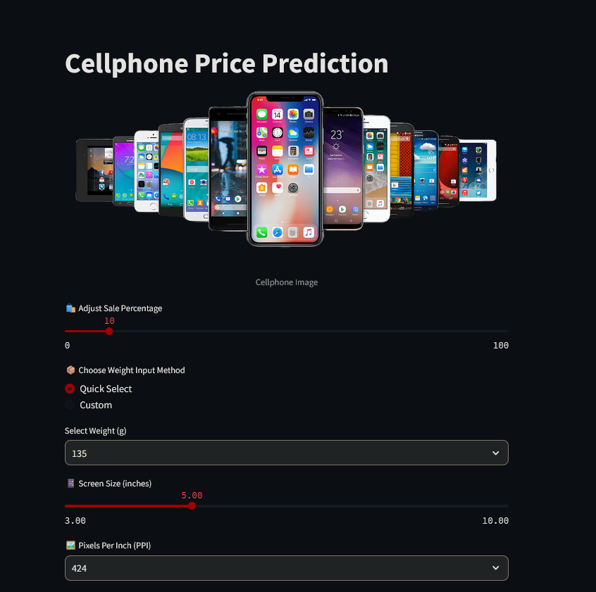

# 📱 Mobile Price Prediction

A machine learning project that predicts mobile phone prices using multiple regression models. The best model is deployed via a **Streamlit** app for interactive price prediction.

---

## 📌 Project Overview

This project evaluates different regression models to determine the most accurate one for predicting mobile phone prices. The selected model (Random Forest) is deployed using a user-friendly Streamlit UI.

- 📓 Training & analysis done in `notebook.ipynb`
- 🧠 Best model (`Random Forest`) saved as `best_rf.pkl`
- 📊 Preprocessing scaler saved as `scaler.pkl`
- 🌐 Web app built in `app.py`
- 🎨 Visual branding/image: `mobile.png`

---

## 🚀 Getting Started

### 1. Clone the Repo

```bash
git clone https://github.com/vishalgupta-git/mobile_price_prediction.git
cd mobile_price_prediction
```
### 2. Install Dependencies
```bash
pip install -r requirements.txt
```
### 3. Run the Streamlit App
```bash
streamlit run app.py
```
## 🛠 Tools & Technologies Used

### 📊 Machine Learning & Data Processing
- Python 3.x  
- Pandas  
- NumPy  
- Scikit-learn  

### 📉 Modeling Techniques
- Linear Regression  
- Decision Tree Regressor  
- Random Forest Regressor  
- Model evaluation with RMSE, MAE, R²  

### 📈 Visualization
- Matplotlib  
- Seaborn  

### 🌐 Web App & Deployment
- Streamlit – for building the interactive UI  
- Joblib / Pickle – for model and scaler serialization  

### 🧪 Development Tools
- Jupyter Notebook  
- VS Code / Any Python IDE  

### 📜 Licensing
- Apache-2.0 License

## 💡 How to Use the App

Once the app is running:

1. Enter mobile specifications such as:
   - RAM (in GB)
   - Internal Memory
   - Battery Capacity
   - Front & Rear Camera
   - Weight
   - Brand, etc.
2. Click on the **Predict** button.
3. The app will show the predicted price based on your inputs using the trained **Random Forest** model.

---

## 🧠 Model Training Workflow

The training notebook (`notebook.ipynb`) covers:

- Data loading and preprocessing  
- Exploratory Data Analysis (EDA)  
- Feature engineering  
- Training and comparing multiple models  
- Model evaluation  
- Saving the best model and scaler for deployment  

---

## 🖼️ Streamlit UI Preview



> Ensure `ui.png` is located in the root directory of the project to render correctly on GitHub.

---

## 📄 License

This project is licensed under the **Apache-2.0 License**.  
See the `LICENSE` file for more details.

---

## 👤 Author

**Vishal Gupta**  
GitHub: [@vishalgupta-git](https://github.com/vishalgupta-git)

